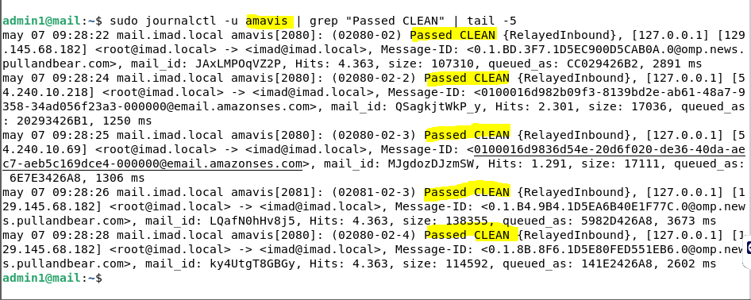
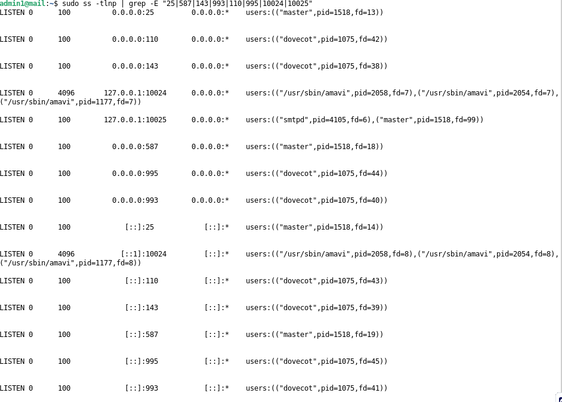
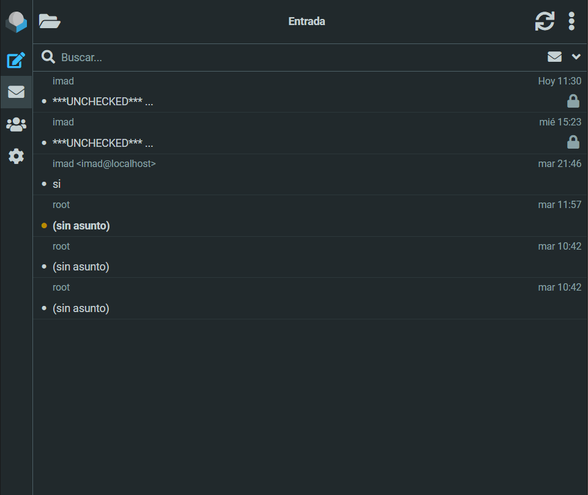
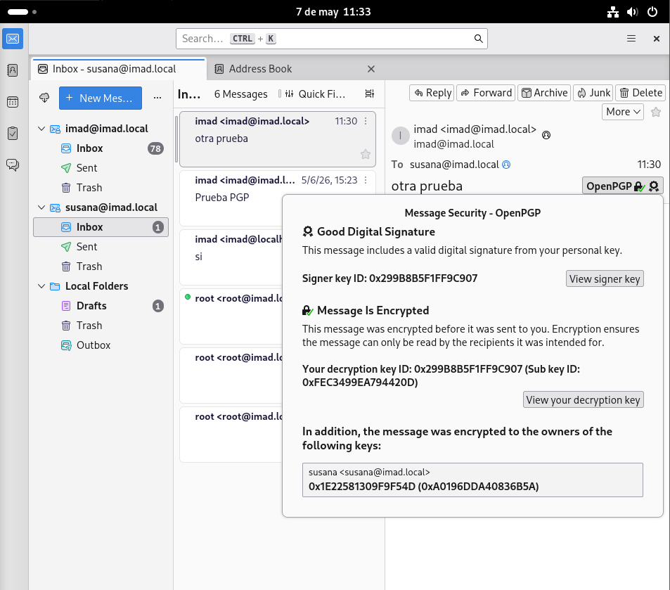
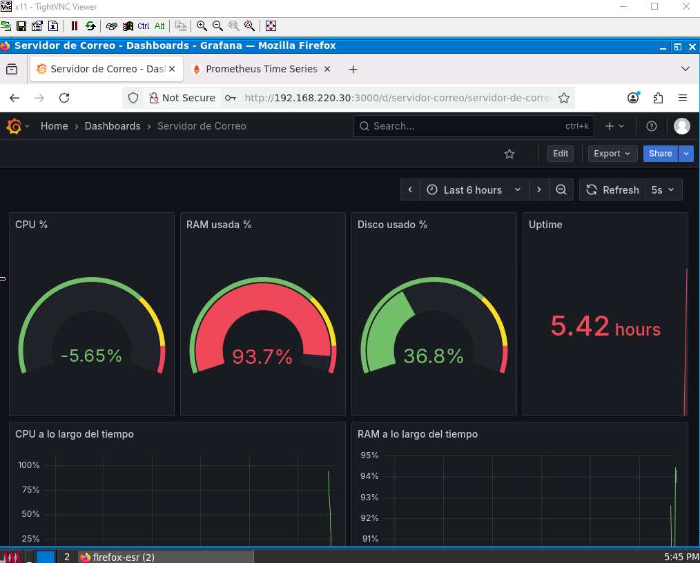

# Servidor de Correo - imad.local

**Imad Chakkour — 2º ASIR — IES Iliberis — 2025/2026**

---

## ¿De qué va esto?

He montado un servidor de correo completo en una Debian 13 desde cero dentro de GNS3. El dominio es `imad.local`, el servidor se llama `mail.imad.local` y tiene la IP `192.168.220.12` en la red de GNS3. Aquí explico todo lo que he instalado y cómo lo he configurado.

---

## Topología en GNS3

El servidor de correo está conectado a la red `192.168.220.0/24` junto con el servidor DHCP. El servidor DNS está en la red `192.168.221.0/24` con la IP `192.168.221.10`.

---

## Lo que he instalado

### Postfix
El MTA, el que envía y recibe correos entre servidores. Lo primero que hay que instalar.

```bash
sudo apt install postfix -y
```

Al instalarlo pide el tipo de configuración, hay que elegir "Sitio de Internet" y poner tu dominio, en mi caso `imad.local`. Lo más importante que he tocado en `main.cf` es el formato de buzón:

```
home_mailbox = Maildir/
```

### Dovecot
El MDA, guarda los correos y deja que los clientes los lean por IMAP o POP3.

```bash
sudo apt install dovecot-core dovecot-imapd dovecot-pop3d -y
```

**Problema que tuve:** Dovecot 2.4 (la versión de Debian 13) ha cambiado un montón de cosas respecto a versiones anteriores. El archivo principal tiene que empezar con `dovecot_config_version = 2.4.1` sino no arranca. También cambiaron nombres de parámetros, por ejemplo `mail_location` ahora es `mail_driver` y `mail_path`, y `ssl_cert` ahora es `ssl_server_cert_file`. Me tiré un buen rato con esto.

### Maildir
Formato en el que se guardan los correos. Cada correo es un archivo independiente, mucho mejor que mbox que lo mete todo junto. Los buzones están en `/home/imad/Maildir/` y `/home/susana/Maildir/`.

```bash
sudo maildirmake.dovecot /home/imad/Maildir
sudo maildirmake.dovecot /home/susana/Maildir
sudo chown -R imad:imad /home/imad/Maildir
sudo chown -R susana:susana /home/susana/Maildir
```

### Seguridad (Amavis + ClamAV + SpamAssassin)
Amavis coge los correos antes de que lleguen al buzón y los manda a analizar. ClamAV busca virus y SpamAssassin puntúa si es spam (más de 5 puntos = spam).

```bash
sudo apt install amavisd-new spamassassin clamav clamav-daemon -y
```

El flujo queda así:
```
Postfix (25) → Amavis (10024) → ClamAV + SpamAssassin → Postfix (10025) → buzón
```

Aquí se puede ver cómo Amavis procesa los correos y los marca como limpios:



### Puertos activos

Todos los servicios escuchando correctamente:



### TLS/SSL
He creado una CA propia y con ella he firmado el certificado del servidor. No he usado el certificado autofirmado que viene por defecto (snakeoil) porque buscando informacion, he visto que no es correcto usarlo.

### Roundcube
Cliente web de correo, se accede desde el navegador. Necesita Apache, PHP y MariaDB.

```bash
sudo apt install roundcube roundcube-mysql -y
```

Acceso: `http://192.168.220.12/roundcube`



### Thunderbird
Cliente de escritorio. Lo he configurado con IMAP en el puerto 143 y SMTP en el puerto 25.

```bash
sudo apt install thunderbird -y
```



### PGP
La firma digital y el cifrado se configura en Thunderbird, no en el servidor. Cada usuario genera sus claves desde `Configuración de cuenta → Cifrado de extremo a extremo`. Para firmar y cifrar un correo al redactarlo vas a `Security → Digitally Sign` y `Encrypt`.

**Problema que tuve:** Para que el cifrado funcione los dos usuarios tienen que intercambiar sus claves públicas primero. La forma más fácil es que cada uno mande un correo firmado al otro, así Thunderbird importa la clave automáticamente.

### Fetchmail
Recoge correos de cuentas externas. Lo he configurado con mi Gmail personal.

```bash
sudo apt install fetchmail -y
```

**Problema que tuve:** La primera vez no puse `fetchlimit` y con 324 mensajes en el Gmail me congeló la máquina entera y tuve que reiniciar.

### DNS
Para que el servidor de correo funcione correctamente en GNS3 he añadido estos registros en el servidor DNS (Bind9 en `192.168.221.10`):

En `/var/lib/bind/db.imad.local` he añadido:
```
; Registro MX - dice que el correo de imad.local lo gestiona mail.imad.local
@        MX   10 mail.imad.local.

; Registro A - dice que mail.imad.local tiene la IP 192.168.220.12
mail     A    192.168.220.12
```

Para verificar que el DNS resuelve correctamente:
```bash
nslookup mail.imad.local 192.168.221.10
nslookup -type=MX imad.local 192.168.221.10
```

**Problema que tuve:** Al editar el archivo de zona a mano con nano, el archivo `.jnl` que usa Bind9 para las actualizaciones dinámicas se desincronizó y daba SERVFAIL. Lo arreglé borrando el archivo journal y reiniciando el servicio.

### Monitorización (Prometheus + Grafana)
He instalado node_exporter en el servidor de correo para que Prometheus pueda recoger métricas.

```bash
sudo apt install prometheus-node-exporter -y
sudo systemctl enable prometheus-node-exporter
sudo systemctl start prometheus-node-exporter
```

Luego he añadido el servidor de correo en la configuración de Prometheus en `/etc/prometheus/prometheus.yml`:


En Grafana he creado un dashboard con paneles de CPU, RAM, disco y uptime del servidor de correo.



---

## Archivos de configuración

Todos los archivos están en el repositorio:

| Archivo | Descripción |
|---|---|
| `main.cf` | Configuración principal de Postfix |
| `master.cf` | Servicios y puertos de Postfix |
| `dovecot.conf` | Configuración principal de Dovecot |
| `10-mail.conf` | Formato de buzones |
| `10-auth.conf` | Autenticación |
| `10-master.conf` | Servicios y puertos Dovecot |
| `10-ssl.conf` | Certificados SSL |
| `config.inc.php` | Configuración Roundcube |

---

## Puertos activos

| Puerto | Servicio |
|---|---|
| 25 | Postfix SMTP |
| 587 | Postfix Submission |
| 143 | Dovecot IMAP |
| 993 | Dovecot IMAPS |
| 110 | Dovecot POP3 |
| 995 | Dovecot POP3S |
| 10024 | Amavis entrada |
| 10025 | Amavis salida |
| 9100 | Node Exporter (Prometheus) |

## Vídeo demostración

[Ver vídeo de demostración - Servidor de Correo](https://drive.google.com/file/d/1-0TNWc4CbYQYQ4bcMSUlH0zQP0fo8EJV/view?usp=sharing)